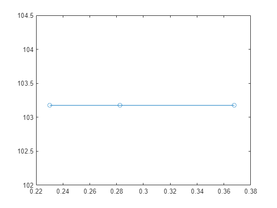
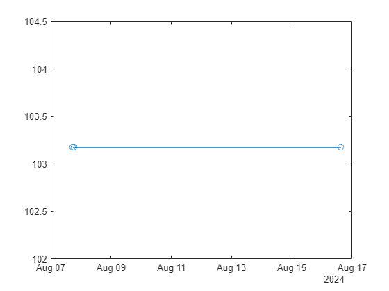

# Contest Report
```matlab
% Read in the list of all solvers
solvers = readtimetable("allSolvers.csv");

% Get rid of bad entries
% The result may be infinite or negative. Neither is a good state.
ix = isinf(solvers.result)|(solvers.result<0);
solvers(ix,:) = [];
```

Here is the list of all the solvers

```matlab
solvers
```
| |t|result|computeTime|score|author|commit|
|:--:|:--:|:--:|:--:|:--:|:--:|:--:|
|1|07-Aug-2024 17:40:34|103.1756|0.2825|544.1268|'MAXPIL0T'|'e40e8a6b1ac3ec055b2fd92398bd616a01a589de'|

```matlab
plot(solvers.computeTime,solvers.result,"-o")
```



```matlab
plot(solvers.t,solvers.result,"-o")
```



Calculate leaders

```matlab
bestScore = inf;
ixLeader = zeros(height(t),1);
```

```matlabTextOutput
Unrecognized function or variable 't'.
```

```matlab
for i = 1:height(solvers)
    if solvers.score(i) < bestScore
        ixLeader(i) = 1;
        bestScore = solvers.score(i);
    end
end

leaders = solvers(ixLeader,:)

```
